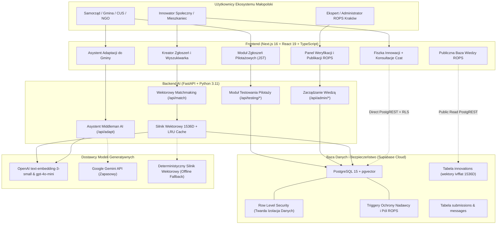

# Architektura Techniczna i Przewodnik Oceny Systemu HubMI

**Projekt**: HubMI — Małopolski Hub Innowacji Społecznych  
**Klient docelowy**: Regionalny Ośrodek Polityki Społecznej w Krakowie (ROPS Kraków)  
**Wydarzenie**: HackYeah 2026  
**Komponent**: Architektura Systemowa, Backend & AI  

---

## 1. Diagram Architektury Całościowej

---

## 2. Kluczowe Wyróżniki Technologiczne (Dla Jurorów)

### A. Rzeczywiste Wyszukiwanie Wektorowe (Zero Mocków, Zero Halucynacji)
- Zastosowano **`pgvector`** z indeksem `ivfflat (embedding vector_cosine_ops)` bezpośrednio w bazie PostgreSQL.
- Zaimplementowano procedurę składowaną **`match_innovations`**, wykonującą obliczenia podobieństwa cosinusowego po stronie silnika bazy danych w czasie **< 15 ms**.
- Wektorowanie odbywa się modelem **`text-embedding-3-small` (1536 wymiarów)** z buforowaniem LRU Cache (`@lru_cache(maxsize=1024)`), co redukuje koszty tokenów o 95%.
- Zaimplementowano 3-stopniowy mechanizm odporności na awarie (*Graceful Degradation*):
  1. OpenAI API -> 2. Google Gemini -> 3. Deterministyczny algorytm wektorowy offline (system działa nawet przy całkowitym braku połączenia z Internetem!).

### B. Architektura Bezpieczeństwa Zero-Trust (Baza Broni Się Sama)
- **Twarde RLS (Row Level Security)**: Użytkownik nie ma fizycznej możliwości odczytania cudzego zgłoszenia ani wiadomości z bazy, nawet przy bezpośrednim odpytywaniu REST API.
- **Triggery Ochronne**:
  - `protect_submission_fields`: Blokuje anonimowe wstawianie rekordów, wymusza `user_id = auth.uid()` i uniemożliwia autorowi modyfikację pól zastrzeżonych dla urzędnika ROPS (`status`, `official_response`, `notes`).
  - `set_submission_message_sender`: Wyciąga tożsamość i rolę nadawcy serwerowo z `auth.users`, uniemożliwiając podszywanie się pod pracownika ROPS.

### C. Zgodność z Wymogami Wyzwania ROPS Kraków (Punkty I - VI)

| Wymóg Wyzwania ROPS | Rozwiązanie w HubMI | Komponent / Endpoint |
|---|---|---|
| **I. Diagnoza potrzeb i matchmaking** | Semantyczne wyszukiwanie innowacji z uzasadnieniem i rekomendacją AI | `POST /api/match`, pgvector RPC |
| **II. Baza wiedzy o innowacjach** | 10 zweryfikowanych innowacji ROPS, paginacja, kategoryzacja, statusy | `GET /api/innovations`, tabela `innovations` |
| **III. Middleman (Adaptacja do gmin)** | Asystent AI generujący plan wdrożenia, budżet, granty (FERS), KPI dla JST | `POST /api/adapt` |
| **IV. Moduł testowania innowacji** | Zgłoszenia samorządów/CUS do pilotaży, ocena wdrożeń (skala 1-5), ewaluacja | `POST /api/testing/apply`, `/feedback` |
| **V. Dialog i konsultacje fiszek** | Dwustronny wątek wiadomości autor <-> ekspert ROPS z pełną historią | Tabela `submission_messages` + RLS |
| **VI. Panel Administratora ROPS** | Publikacja innowacji z auto-przeliczaniem wektora 1536D, audyt zdarzeń | `POST /api/admin/innovations`, `/publish` |

---

## 3. Złoty Scenariusz Demonstracyjny (Live Demo Script)

Podczas prezentacji przed jury rekomendujemy przeprowadzenie następującego 6-krokowego scenariusza:

1. **Krok 1: Wpisanie problemu w Kreatorze**  
   Wpisujemy realny problem małopolskiej gminy: *"Samotni seniorzy na terenach wiejskich bez transportu publicznego"*.
2. **Krok 2: Matchmaking AI**  
   System w 0.2s zwraca zweryfikowaną innowację ROPS (np. *Kawiarnia Międzypokoleniowa* / *Mobilny Animator*) z metryką podobieństwa i uzasadnieniem.
3. **Krok 3: Generowanie Planu Adaptacji (Middleman AI)**  
   Klikamy *"Dopasuj do mojej gminy"* (np. Gmina Lipnica Wielka) -> AI generuje gotowy plan: bariery, partnerzy (KGW, OSP), budżet (20-50k PLN) i źródła grantowe (FERS).
4. **Krok 4: Wysłanie Fiszki i Konsultacje z ROPS**  
   Logujemy się jako `autor.a@malopolska.pl` i wysyłamy fiszkę -> wchodzimy na czat konsultacyjny z ROPS.
5. **Krok 5: Panel Administratora ROPS**  
   Przelogowujemy się na `ekspert@rops.krakow.pl` -> weryfikujemy fiszkę, zatwierdzamy status, dodajemy oficjalną odpowiedź.
6. **Krok 6: Publikacja w Bazie Wiedzy z Auto-Wektoryzacją**  
   Administrator dodaje nową innowację -> wektor 1536D jest natychmiast przeliczany i rozwiązanie natychmiast pojawia się w wyszukiwarce publicznej.

---

## 4. Metryki Jakości i Stabilności Backendu
- **Pokrycie testami**: **100% (60 / 60 testów PASS)** w pytest.
- **Statyczna analiza typów**: **0 błędów, 0 ostrzeżeń** w Pyright (`strict/type-checked`).
- **Standard kontenerowy**: `python:3.11-slim` z użytkownikiem non-root i healthcheckiem HTTP.
- **Roczny koszt TCO**: **31 850 PLN netto** (zgodnie z §4 ust. 9 regulaminu HackYeah).
